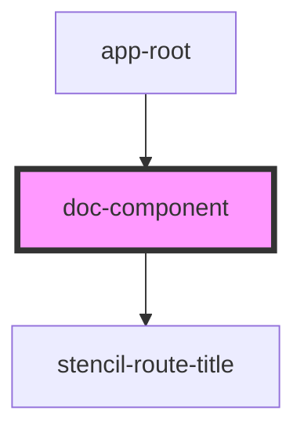

# doc-component

<!-- Auto Generated Below -->

## Properties

| Property | Attribute | Description | Type     | Default     |
| -------- | --------- | ----------- | -------- | ----------- |
| `page`   | `page`    |             | `string` | `undefined` |

## Dependencies

### Used by

 - [app-root](../app-root)

### Depends on

- stencil-route-title

### Graph

----------------------------------------------

*Built with [StencilJS](https://stenciljs.com/)*
